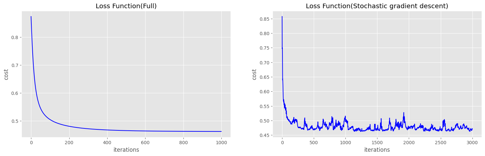

# `Realization logistic regression class(trained using gradient descent or SGD). Decision tree`

<i>an example of optimizing the loss function using the class</i>

Implementation of a logistic regression class trained using two types of gradient descent:
- full (according to all data) gradient descent

- stochastic gradient descent

In the second part, a script is implemented that finds the optimal feature and the optimal threshold for splitting at the 
node of the tree.